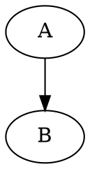
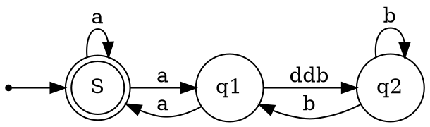
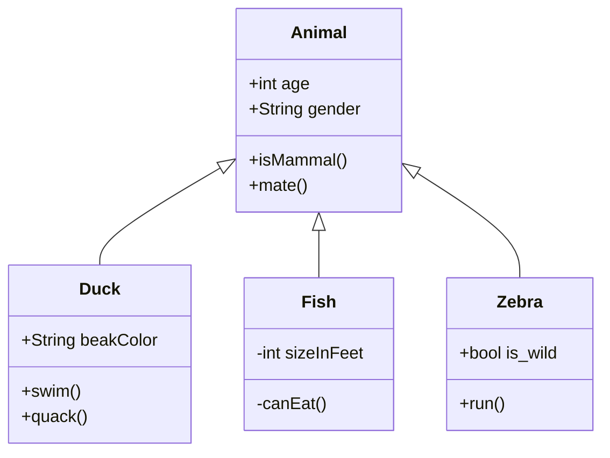
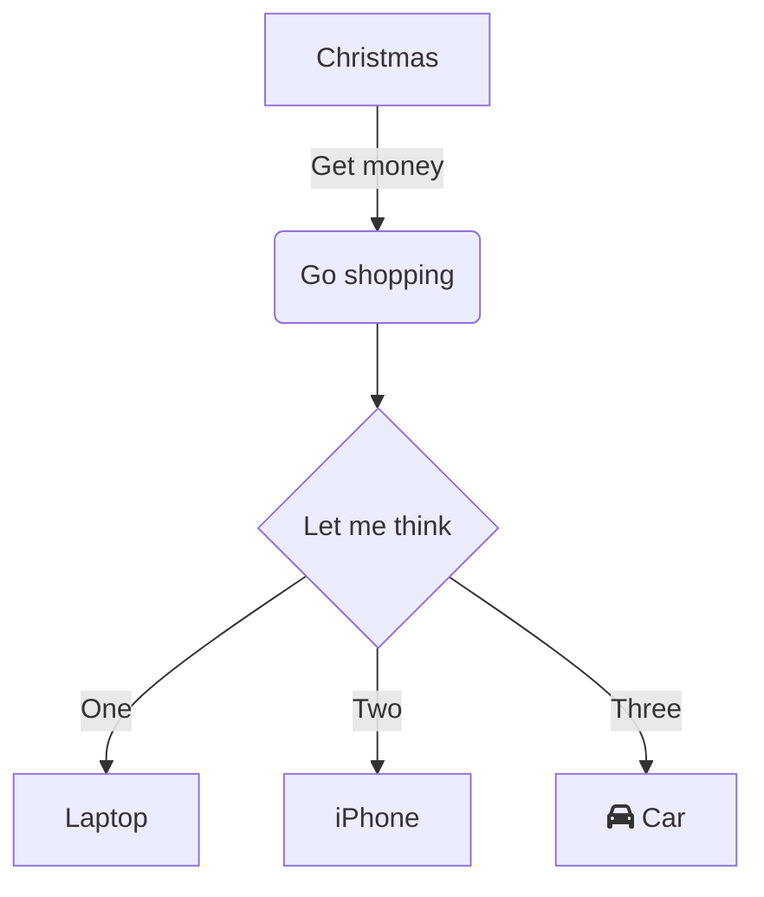

# Using Graphs...

## Basic Graphviz

### DOT Language is surrounded by delimiters

### A Finite State Machine in GraphViz

### More on [GraphViz](http://www.graphviz.org/) and [the DOT Language](http://www.graphviz.org/doc/info/lang.html)

[The DOT language](https://en.wikipedia.org/wiki/DOT_(graph_description_language)) was developed by AT&T and is Open Source

## Other Charts

### Mermaid

[Mermaid](https://mermaid.ink/) adds several charting capabilities...

#### Class Diagrams

#### Decision/Flow Charts

